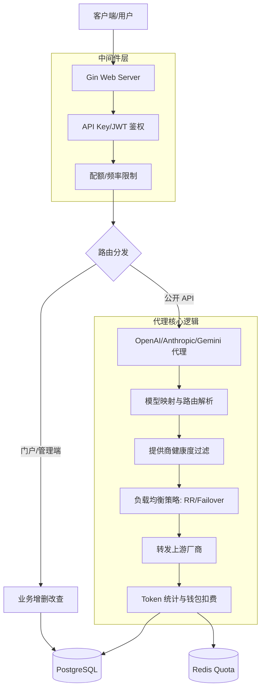

# WcsTransfer 后端架构说明 (v3)

WcsTransfer 是一个高性能的 LLM (大语言模型) 代理网关，提供多模型映射、自动路由、多租户管理及计费监控功能。

## 目录结构

```text
backend/
├── cmd/
│   └── server/          # 程序入口，负责配置加载和服务器启动
├── internal/
│   ├── api/             # API 处理器层 (Handlers)
│   │   ├── admin/       # 管理端业务接口
│   │   ├── adminauth/   # 管理端登录鉴权
│   │   ├── openai/      # 核心代理逻辑 (支持 OpenAI, Anthropic, Gemini)
│   │   ├── system/      # 系统级接口 (健康检查、文档)
│   │   └── tenant/      # 租户门户 (Portal) 业务接口
│   ├── app/             # 应用初始化逻辑
│   ├── config/          # 配置定义与加载
│   ├── entity/          # 核心业务对象定义 (Domain Models)
│   ├── middleware/      # Gin 中间件 (鉴权、配额、CORS、日志)
│   ├── platform/        # 平台级基础能力 (数据库、Redis 连接)
│   ├── repository/      # 数据访问层接口及实现 (Postgres)
│   ├── router/          # 路由注册与依赖组装中心
│   ├── service/         # 业务逻辑服务层 (配额计算、健康探测、对账)
│   └── apierror/        # 统一错误定义
└── migrations/          # 数据库迁移脚本 (SQL)
```

## 路由分组说明

系统路由目前分为五大核心分组：

### 1. 系统与文档接口
*   **路径**: `/healthz`, `/version`, `/docs`
*   **功能**: 负责容器健康检查、版本查看及 Swagger/ReDoc 文档展示。

### 2. 异步化工作池 (Background Worker Pool)
*   **实现**: 引入了显式的任务队列和固定数量的 Worker 协程（v3 优化）。
*   **优势**: 所有的日志写入、计费扣费、配额更新均通过 `BackgroundWorker` 异步处理，避免了在高并发下产生海量 Goroutine 导致的内存压力和数据库连接耗尽。
*   **容错**: 工作池内置了 Panic 恢复机制，确保单个后台任务的崩溃不会影响整个系统的稳定性。
*   **管理端鉴权**: `/admin/auth/login`
*   **租户门户鉴权**: `/portal/auth/login`
*   **说明**: 负责管理员和租户用户的 JWT 颁发。

### 3. 公共 API 接口 (The Proxy Core)
*   **分组**: `/v1`, `/v1beta`
*   **中间件**: 公开 API 鉴权 (PublicAPIAuth)、配额频率限制 (PublicAPIQuota)。
*   **核心功能**:
    *   `/chat/completions`: OpenAI 标准对话。
    *   `/embeddings`: 向量化接口。
    *   `/messages`: Anthropic 兼容接口。
    *   `/gemini/*`: Google Gemini 原生格式支持。
*   **逻辑**: 自动识别上游协议，执行路由策略（固定、轮询、故障转移），处理 Token 计费和钱包扣费。

### 4. 租户门户接口 (Portal)
*   **路径**: `/portal/*`
*   **中间件**: 租户用户 JWT 鉴权。
*   **功能**: 提供租户侧的调用统计、模型列表、API Key 管理、钱包流水查看及在线调试工具。

### 5. 管理端后台接口 (Admin)
*   **路径**: `/admin/*`
*   **中间件**: 管理员 JWT 鉴权。
*   **功能**: 系统的全权管理，包括提供商配置、模型映射规则、租户/用户管理、钱包人工充值/修正、全局日志审计及账务对账。

## 核心业务逻辑图 (Mermaid)



## 开发者指南

### 环境要求
*   Go 1.22+
*   PostgreSQL 15+
*   Redis (可选，用于高性能配额限制)

### 本地运行
1.  复制并配置 `.env` 文件。
2.  运行 `go run cmd/server/main.go`。
3.  访问 `http://localhost:8080/docs` 查看 API 文档。

---
*注：本项目代码包含由 Codex、Claude Code 辅助生成的组件，当前由 v3 版本进行架构优化和性能打磨。*
